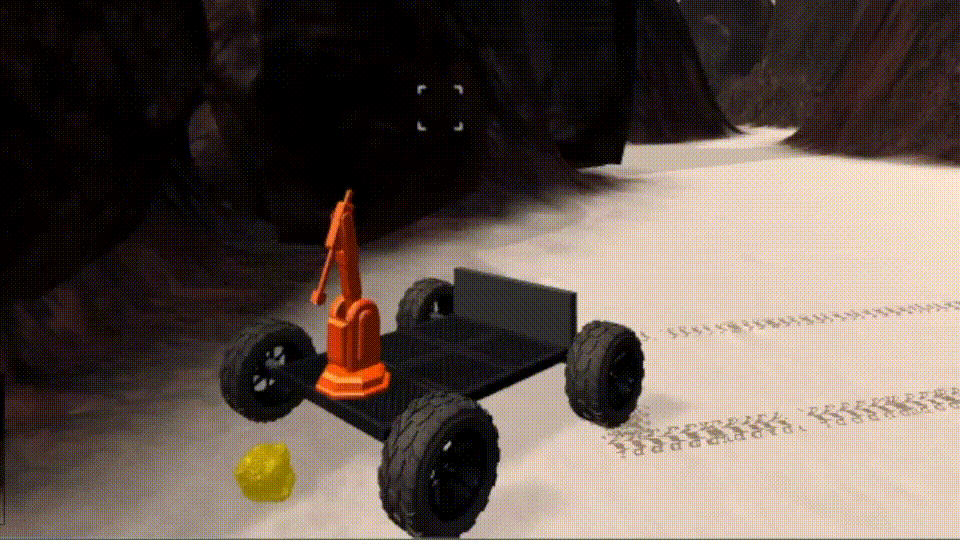

# Robo_nd Search and Sample Return Project


## The Configuration for the Simulator

The Rover simulator version is based on the x86_64 in linux environment and Grafics with the resolution of 640*480 and fast graphics quality

## Notebook analysis
In "color thresholding" part 
obs_thresh rock_thresh function
I added the two functions above, respectively for the obstacle and rock sample detection.
for the obstacle detection, just the same way as the threshold method, just reverse the comparision relation to set the true value when the pixel belows the threshold.
As for the rock detection, just as the  opencv reference instructs, first the image is converted to the hsv space, and then to be processed into a binary image with the threshold range corresponding to the rock sample image at hsv space, also the number of pixels for the rock sample is also calculated. The output of rock_thresh function is a tumple, mask as the binary image of rock sample, count_rock as the number of rock pixels

In function "process_image"
firstly the original image is read and past through the perspective transform, then the next step is to process the warped image with three different threshold function, respectively for the rock detection, obstacle and navigable terrian. And then these three output images are fed into another three diffrent funcitons for the rover pixel position converted to world map position, lastly the three outputs are registered into three different arrays corresponding to the different channels of colorful image.

```sh
jupyter notebook
```


## Navigating autonomously and mapping
`perception.py` Just same as what I have populated in the perception_step at bottom, the three functions will generate respectively the pixels for the navigable area obstacle and rock, then will be stored in the arrays, the navigable pixels and the rock pixels will be fed into the input of the function, to be transformed into the polar coordinate, then the rock pixel is also used for the navigation to find the rock sample. So there is a flag "near_sample" for the trigger of of pick up. But while the vehicle moves, the rock sample maybe locate far away, in order to make the rover realizes in advance, an additional flag "image_close_sample" is used together to trigger the pickup sequence.   
`drive_rover.py` in this file some new variables are added into the "Rover_state" class, like the flag, and some  variables  for the registration of the navigating angles.
Te call of send_pick command is also modified with the new flags to be setted to zero. 
`decision.py` in this function just more detailed conditions are added following the original case. The top most case, namely the "stop" state and "forward" state are expanded with the flag, which will be set to one when the rock pixel is above the threshold, the state is same as the regular state switch between the move and stop, a difference lies in that once the moving rover has detected the rock nearby it will stop and moving closer towards the sample and simutaneously turn the rover's heading direction toward the rock sample until it is within a range when the near_sample is set. 

```sh
python drive_rover.py
```  


## Navigating result
To some extent the rover can map above 40% of the environment and the fidelity is also above 60% as the recording shows, the problem is that the pick up sequence is still not working very well, sometimes when the rock is found at first, the rover cannot stop and move closer toward the sample to implement the pick up. And at the cross of three roads, the rover is always trapped into a circular loop, this is due to the navigable angle is not so accurate,  which is just using mean value of the navigable area, and the sample is usuallly located near the mountain foot, so the rover should be further supplemented with the movement along the wall, this could be done with more detailed image process for the sample location identification. 
**Note: The Rover simulator version is based on the x86_64 in linux environment and Grafics with the resolution of 640*480 and fast graphics quality.FPS is 30**



